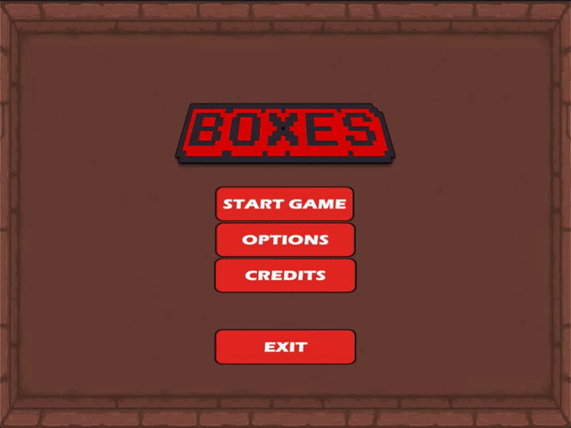
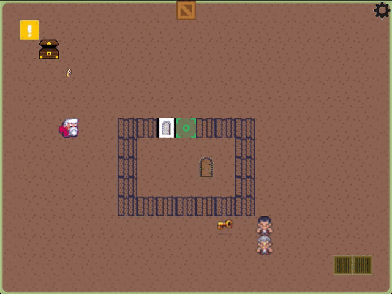

# Boxes
A 2D RPG game made for BC Game Jam 2019

## Themes
* Energy
* Flight

## Built with
* [Löve](https://love2d.org/) - A free 2D game engine
* [Lua](https://www.lua.org/) - Lightweight, embeddable programing language

## HOW TO TRY IT OUT
You need:
* Linux/Mac OS/Windows machine
* Löve installed

How to:
- Download the repository
- Drag the whole folder to Löve's icon

(The game has been created during a 48-hour hackathon, so there is not much that can be done in a game now. Stay tuned for the updates!)

